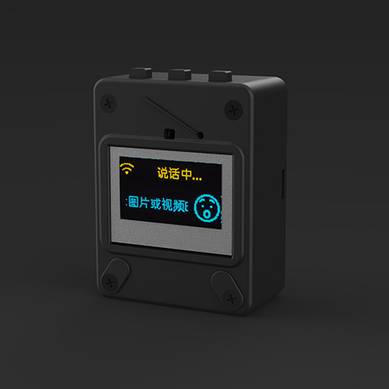

# XingZhi AI Chatbot


## 项目目的

本项目是一个开源项目，以 MIT 许可证发布，允许任何人免费使用，并可以用于商业用途。

<div style="display: flex; justify-content: center; gap:100px">
  <a href="docs/v1/wmnologo_xingzhi_1.54.jpg" target="_blank" title="无名科技Nologo-星智-1.54">
    
  </a>
  <a href="docs/v1/wmnologo_xingzhi_0.96.jpg" target="_blank" title="无名科技Nologo-星智-0.96">
    
  </a>
</div>

### 开发环境

- 安装 [ESP-IDF](https://dl.espressif.cn/dl/esp-idf/) 

选择`ESP-IDF v_xx - Offline Installer`， `SDK` 版本 5.3 或以上，一路默认安装即可


## 固件部署

### 构建

1. 打开`ESP-IDF x.x PowerShell`终端拉取代码

```bash
git clone https://github.com/waahah/esp-xingzhi
cd esp-xingzhi
```

2. 清除构建缓存

```bash
idf.py fullclean
```

3. 指定项目的开发板
```bash
idf.py set-target esp32s3
```

4. 打开底层配置菜单
```bash
idf.py menuconfig
```

5. 选择板子
```bash
Xiaozhi Assistant -> Board Type -> xingzhi-cube-x-x
```
> 按 `S` 保存，按 `Q` 退出。
6. 关闭语音唤醒（可选）
```bash
Xiaozhi Assistant -> [ ] 启用语音唤醒与音频处理 -> Unselect
```

7. 修改 flash 大小（可选）
```bash
Serial flasher config -> Flash size -> 16 MB
```

8. 修改分区表（可选）
```
Partition Table -> Custom partition CSV file -> partitions.csv
```
9. 关闭片外 PSRAM（可选）
```
Component config -> ESP PSRAM -> [ ] Support for external, SPI-connected RAM -> Unselect
```

10. 编译整个项目
```bash
idf.py build
```


### 合并

合并要下载到MCU内的3个文件：

- /build/bootloader 目录下的 `bootloader.bin`。
- /build/partition_table 目录下的 `partition-table.bin`。
- /build 下的 `xiaozhi.bin`。

```bash
esptool.py --chip esp32s3 merge_bin -o merged_xingzhi.bin 0x0 build/bootloader/bootloader.bin 0x8000 build/partition_table/partition-table.bin 0xd000 build/ota_data_initial.bin 0x10000 build/srmodels/srmodels.bin 0x100000 build/xingzhi.bin
```
或者
```bash
esptool.py --chip esp32 merge_bin -o merged-flash.bin \
0x0 build/bootloader/bootloader.bin \
0x8000 build/partition_table/partition-table.bin \
0x100000 build/xingzhi.bin \
0xd000 build/ota_data_initial.bin \
0x10000 build/srmodels/srmodels.bin
```


### 烧录

将开发板连接到电脑：

👉有IDF开发环境：
```bash
idf.py flash -p COM8 -b 115200
```

👉无IDF开发环境（建议）：

- [Flash客户端烧录固件](https://ccnphfhqs21z.feishu.cn/wiki/Zpz4wXBtdimBrLk25WdcXzxcnNS) 

- [ESP-Launchpad 浏览器WEB端烧录](https://espressif.github.io/esp-launchpad/) 

烧录完毕后，按一下 RESET 按钮重启。

新手第一次操作建议先不要搭建开发环境，直接使用烧录好的固件。

固件默认接入 [xiaozhi.me](https://xiaozhi.me) 官方服务器，目前个人用户注册账号可以免费使用 Qwen 实时模型。


### 调试

```bash
idf.py monitor -p COM8
```
打开串口监视器查看打印信息


## 客户端构建

👉个人手机上使用 [xiaozhi-android-client](https://github.com/TOM88812/xiaozhi-android-client)

👉个人电脑上使用 [py-xiaozhi](https://github.com/Huang-junsen/py-xiaozhi)


## 私有化部署

👉个人电脑上部署服务器

- [xiaozhi-esp32-server](https://github.com/xinnan-tech/xiaozhi-esp32-server)

- [打造自己的AI好友](https://github.com/78/xiaozhi)


## 扩展

- [添加自定义唤醒词的简单方案](https://kcn80f4hacgs.feishu.cn/wiki/OxsZwab8iiGYjvkH9SBcFK2anmh)

- [终端控制GPIO/定时提醒方案](https://kcn80f4hacgs.feishu.cn/docx/J2MrdqW27oybcCxu7Sfc4gBcn4g)

- [通信协议：Emoji 心情显示](https://ccnphfhqs21z.feishu.cn/wiki/LDN2wbdRyi6evQk6xgXcTe6ened)

- [通信协议：Websocket 连接](https://ccnphfhqs21z.feishu.cn/wiki/M0XiwldO9iJwHikpXD5cEx71nKh)


## 已实现功能

- [x] Wi-Fi / ML307 Cat.1 4G
- [x] BOOT 键唤醒和打断，支持点击和长按两种触发方式
- [x] 离线语音唤醒 [ESP-SR](https://github.com/espressif/esp-sr)
- [x] 流式语音对话（WebSocket 或 UDP 协议）
- [x] 支持国语、粤语、英语、日语、韩语 5 种语言识别 [SenseVoice](https://github.com/FunAudioLLM/SenseVoice)
- [x] 声纹识别，识别是谁在喊 AI 的名字 [3D Speaker](https://github.com/modelscope/3D-Speaker)
- [x] 大模型 TTS（火山引擎 或 CosyVoice）
- [x] 大模型 LLM（Qwen, DeepSeek, Doubao）
- [x] 可配置的提示词和音色（自定义角色）
- [x] 短期记忆，每轮对话后自我总结
- [x] OLED / LCD 显示屏，显示信号强弱或对话内容
- [x] 支持 LCD 显示图片表情
- [x] 支持多语言（中文、英文）


## 许可证

```
MIT License

Copyright (c) 2024 Xiaoxia

Permission is hereby granted, free of charge, to any person obtaining a copy
of this software and associated documentation files (the "Software"), to deal
in the Software without restriction, including without limitation the rights
to use, copy, modify, merge, publish, distribute, sublicense, and/or sell
copies of the Software, and to permit persons to whom the Software is
furnished to do so, subject to the following conditions:

The above copyright notice and this permission notice shall be included in all
copies or substantial portions of the Software.

THE SOFTWARE IS PROVIDED "AS IS", WITHOUT WARRANTY OF ANY KIND, EXPRESS OR
IMPLIED, INCLUDING BUT NOT LIMITED TO THE WARRANTIES OF MERCHANTABILITY,
FITNESS FOR A PARTICULAR PURPOSE AND NONINFRINGEMENT. IN NO EVENT SHALL THE
AUTHORS OR COPYRIGHT HOLDERS BE LIABLE FOR ANY CLAIM, DAMAGES OR OTHER
LIABILITY, WHETHER IN AN ACTION OF CONTRACT, TORT OR OTHERWISE, ARISING FROM,
OUT OF OR IN CONNECTION WITH THE SOFTWARE OR THE USE OR OTHER DEALINGS IN THE
SOFTWARE.
```